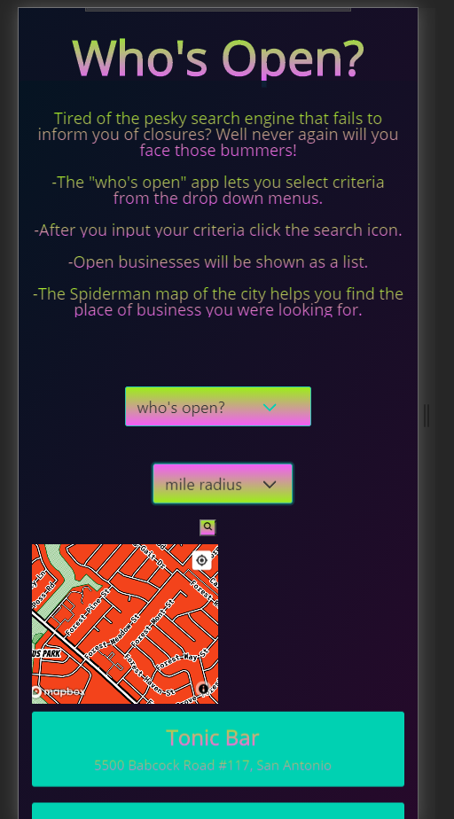

# Who-s-Open
Tired of the pesky search engine that fails to inform you of closures? 
Well never again will you face those bummers!
-The "who's open" app lets you select criteria from the drop down menus.
-After you input your criteria click the search icon.
-Open businesses will be shown as a list.
-The Spiderman map of the city helps you find the place of business you were looking for.

## User Story
As aanyone living through the covid-19 pandemic
I want to see what places are actualy open close to my location
So that i dont waste time going to places that are closed

## Demo
The following image demonstrates the application functionality:

## Review
created with HTML, CSS, javaScript, Jquery,mapbox,howlerjs

CSS Framework: Bulma

API's used
Google places API
Mapbox API

- The URL of the deployed application.
   https://malex19889.github.io/Who-s-Open/

- The URL of the GitHub repository.
  https://github.com/malex19889/Who-s-Open.git
